# Full Flow (Specs-Driven Development) — How It Works

This document describes the **full flow** (`ai/flows/full-flow.md`), the specs-driven development
flow of the AI setup, for human readers. For the setup as a whole — the directory structure, the
other flows, and the `/setup-ai` skill — see [`overview.md`](./overview.md).

The idea of the full flow is simple: **a feature description (spec) is the single source of
truth**. Nothing gets implemented until a spec exists, and everything that gets implemented is
continuously validated back against that spec by skills and independent subagents.

Project-specific commands used throughout the flow (starting the app, running tests, lint,
migrations) are defined in `ai/project.md`; the diagrams below show this template's defaults.

---

## 1. The Big Picture

The full flow is organized into three cooperating layers plus the specs they revolve around:

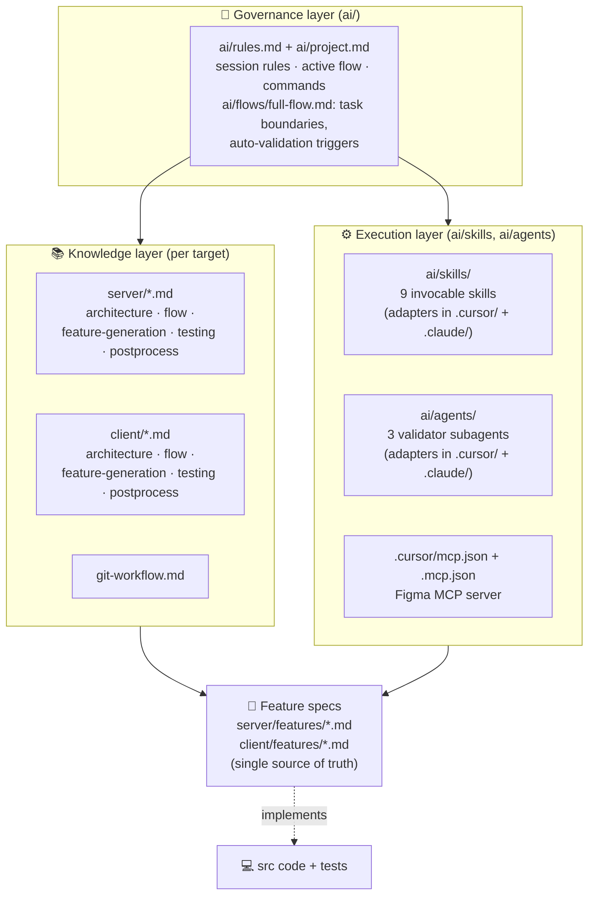

- **Governance layer** — `.cursorrules` / `CLAUDE.md` point to `ai/rules.md`, which is read at
  the start of every session. `ai/project.md` names the active flow and all project commands. In
  the full flow, `ai/flows/full-flow.md` defines what a session is allowed to do and *forces*
  validations to run at specific points.
- **Knowledge layer** — the `*.md` docs in `server/` and `client/` hold the patterns, conventions,
  and step-by-step flows the agent must follow. They are referenced, not executed.
- **Execution layer** — `ai/skills/` and `ai/agents/` hold the runnable pieces: **skills**
  (procedures the agent invokes with `/name`), **subagents** (independent validators with their
  own context), and the **MCP** configs (Figma integration for design-driven layout work). Thin
  adapters in `.cursor/` and `.claude/` register them with each tool.
- **Specs** — every feature lives as one markdown file in `server/features/` or `client/features/`.

---

## 2. Files the Full Flow Uses

### Governance

| File | Purpose |
|------|---------|
| `ai/flows/full-flow.md` | The flow definition itself: one-task-per-session rule, task type/target boundaries, mandatory auto-validation gates. |
| `ai/project.md` | Project config: commands (app/tests/lint), migrations policy, knowledge-doc index. Single source of truth for project facts. |
| `git-workflow.md` | Branch strategy, Angular/commitlint commit format, pre-commit checks, push workflow. |

### Knowledge docs (mirrored for `server/` and `client/`)

| File | Purpose |
|------|---------|
| `architecture.md` | Patterns & conventions. Server: resolver→service→DAO, file suffixes, error handling. Client: components, design tokens, routing. |
| `feature-generation-flow.md` | Step-by-step process for **writing a spec** section by section with user confirmation. |
| `flow.md` | Step-by-step process for **implementing** a spec (TDD on the server; layout-first on the client). |
| `testing.md` | Testing patterns and conventions (unit / integration / API / E2E). |
| `postprocess.md` | Post-implementation quality checklist (scope, overengineering, defensive code, logging, etc.). |

### Execution layer (`ai/skills/`, `ai/agents/`)

Skill and agent instructions live in `ai/`; `.cursor/skills/*/SKILL.md`, `.claude/skills/*/SKILL.md`,
`.cursor/agents/*.md` and `.claude/agents/*.md` are thin adapters that point at them.

| File | Type | Purpose |
|------|------|---------|
| `.cursor/mcp.json` + `.mcp.json` | MCP config | Registers the **Figma** developer MCP server (`figma-developer-mcp`) used by layout iteration (Cursor and Claude Code respectively). |
| `ai/agents/spec-validator.md` | Subagent | Comprehensive spec completeness/consistency validator (independent context). |
| `ai/agents/test-plan-validator.md` | Subagent | Validates a test plan covers every spec requirement. |
| `ai/agents/implementation-verifier.md` | Subagent | Independently verifies implementation code matches the spec. |
| `ai/skills/validate-feature-spec.md` | Skill | Quick inline spec structure/quality check. |
| `ai/skills/check-test-coverage.md` | Skill | Maps generated tests back to spec requirements. |
| `ai/skills/verify-implementation.md` | Skill | Inline spec-vs-code verification. |
| `ai/skills/check-architecture-compliance.md` | Skill | Checks code against `architecture.md` patterns. |
| `ai/skills/run-tests.md` | Skill | Runs unit, server integration/e2e, and Playwright E2E tests (commands from `ai/project.md`) with auto app startup. |
| `ai/skills/git-workflow.md` | Skill | Executes the git branch/commit/push workflow. |
| `ai/skills/generate-css-wireframe.md` | Skill | Generates a CSS container-structure wireframe as a chapter in the spec (frontend). |
| `ai/skills/layout-iteration.md` | Skill | Iterates layout in the browser until it matches the Figma screenshot. |

### Supporting

| File | Purpose |
|------|---------|
| `server/features/example-feature.md` | Reference backend spec (7 sections). |
| `client/features/example-feature.md` | Reference frontend spec (9 sections + wireframe). |

---

## 3. Session Model — One Task at a Time

The full flow enforces a strict session model. A session does **exactly one** task, defined by two
axes: **what** (generate a spec vs. implement) and **where** (backend vs. frontend).

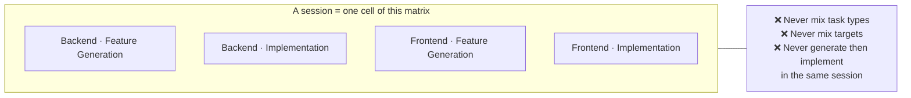

This boundary keeps context focused and prevents the agent from drifting between unrelated concerns.

---

## 4. Workflow A — Feature Generation (writing the spec)

Triggered by *"let's generate a server feature"* / *"let's generate a client feature"*. The agent
builds the spec **one section at a time**, pausing for user confirmation after each, then validates
before saving.

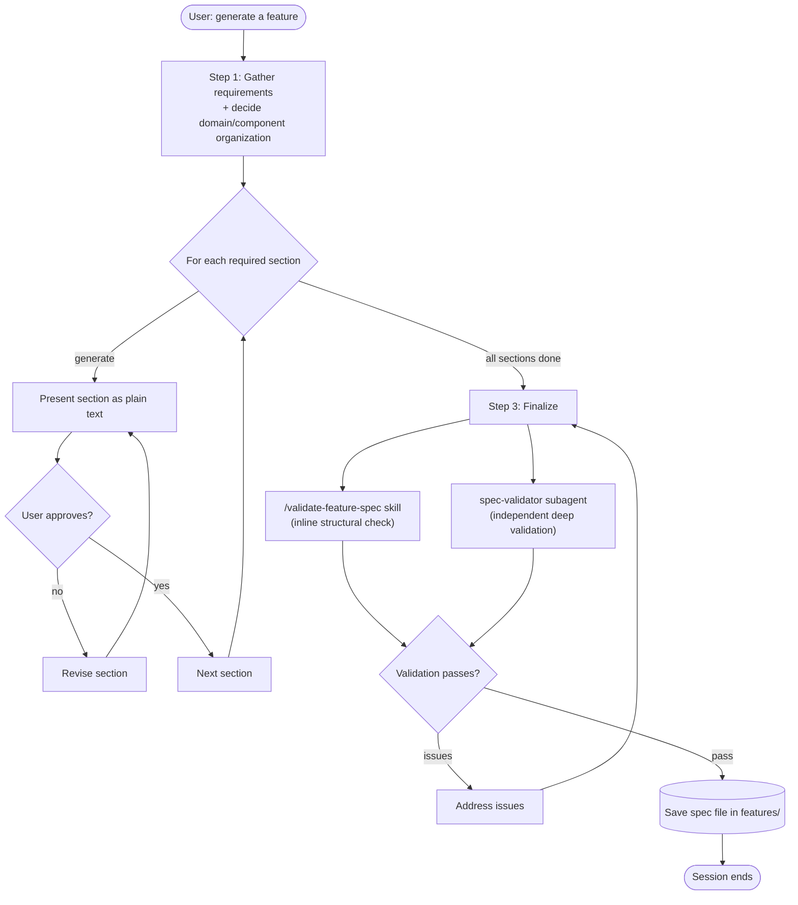

**Required sections differ by target:**

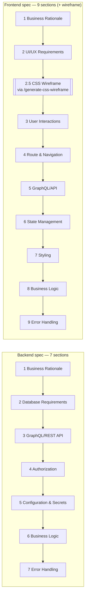

> The wireframe is always a **chapter inside the single spec document** — never a separate file —
> so the implementation flow has exactly one source per feature.

---

## 5. Workflow B — Backend Implementation (`server/flow.md`)

Backend implementation is **test-driven**: the test plan and tests come *before* the code. Only
**Step 1 requires user approval** — after the test plan is accepted, Steps 2–7 run automatically.

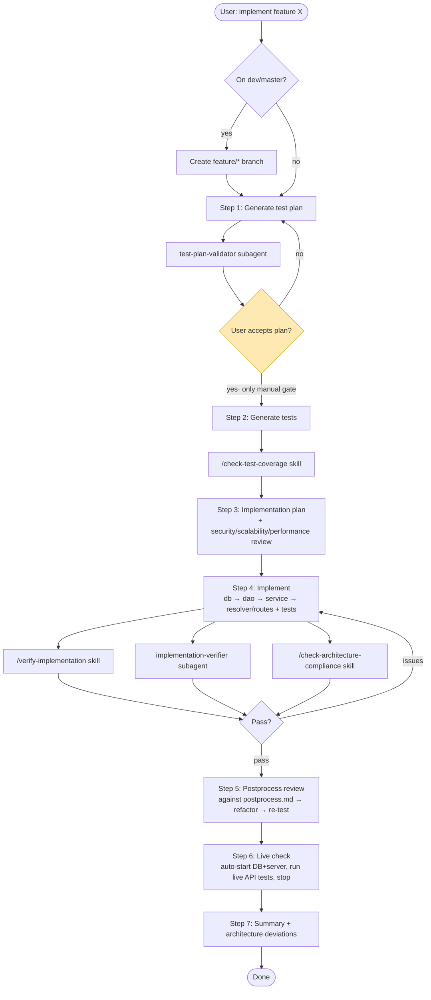

**Server data-flow pattern enforced in Step 4** (from `architecture.md`):

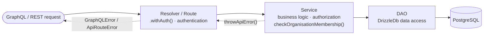

---

## 6. Workflow C — Frontend Implementation (`client/flow.md`)

Frontend implementation is **layout-first**: positioning and styling are built and visually matched
to the Figma design *before* any interactions or data fetching are added. Tests come **after**
implementation. Manual gates exist at Steps 1, 3, 5, and 6.

```mermaid
flowchart TD
    F0([User: implement feature X]) --> P1[Step 1: Implementation plan<br/>Part A = layout · Part B = interactions/data<br/>confirm Figma screenshot]
    P1 --> G1{User approves plan?}
    G1 -->|no| P1
    G1 -->|yes| P2[Step 2: Layout only<br/>design-system components + tokens<br/>static/placeholder content]

    P2 --> P3["Step 3: /layout-iteration skill<br/>auto-start dev server → open in browser<br/>→ screenshot → compare to Figma → fix → repeat"]
    P3 --> G3{Layout matches Figma?<br/>user approves}
    G3 -->|no| P3
    G3 -->|yes| P4[Step 4: Interactions + data<br/>GraphQL · state · handlers · a11y]

    P4 --> V1["/verify-implementation + implementation-verifier<br/>+ /check-architecture-compliance"]
    V1 --> P5[Step 5: Test plan] --> TPV[test-plan-validator subagent]
    TPV --> G5{User accepts plan?}
    G5 -->|no| P5
    G5 -->|yes| P6[Step 6: Generate tests<br/>incl. Playwright E2E] --> CTC["/check-test-coverage"]
    CTC --> G6{User accepts tests?}
    G6 -->|no| P6
    G6 -->|yes| P7[Step 7: Postprocess review + refactor]
    P7 --> P8[Step 8: Summary] --> FD([Done])

    style G1 fill:#ffe9b3,stroke:#d9a300
    style G3 fill:#ffe9b3,stroke:#d9a300
    style G5 fill:#ffe9b3,stroke:#d9a300
    style G6 fill:#ffe9b3,stroke:#d9a300
```

**Server vs. client flow at a glance:**

| | Backend (`server/flow.md`) | Frontend (`client/flow.md`) |
|---|---|---|
| Methodology | Test-Driven (tests before code) | Layout-first (tests after code) |
| Manual gates | Step 1 only | Steps 1, 3, 5, 6 |
| Key external tool | DB container / live API check | Figma MCP + browser MCP |
| Steps | 7 | 8 |

---

## 7. The Validation & Verification Engine

This is the heart of the full flow. `ai/flows/full-flow.md` makes validations **mandatory and non-conditional**
("Never skip", "Never ask permission"). Two kinds of checkers run at each gate:

- **Skills** — lightweight, inline procedures that run in the main session context.
- **Subagents** — independent agents with their *own* context, giving an unbiased second opinion
  without polluting the main session.

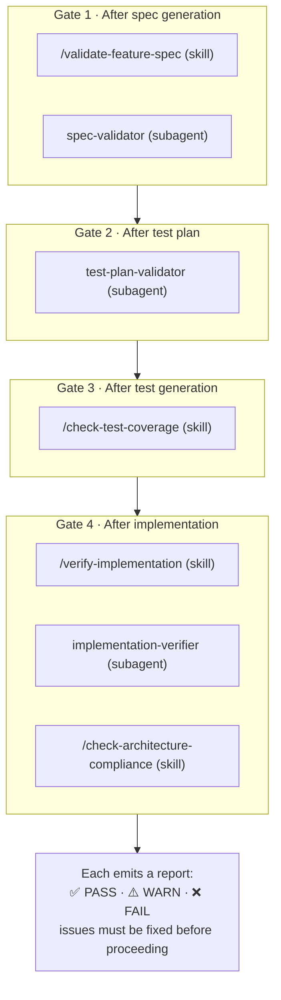

### Skill vs. subagent responsibilities

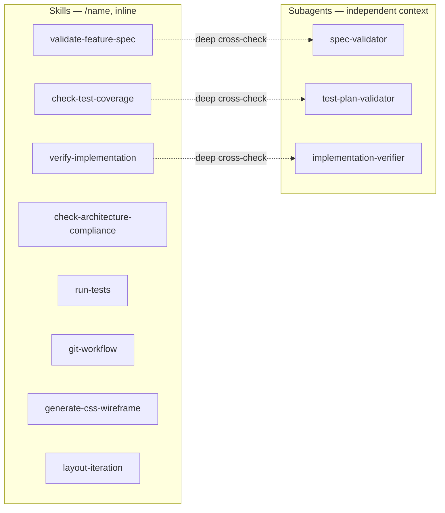

Each checker produces a structured report with a **PASS / WARN / FAIL** status, a per-requirement
table, and concrete recommendations. The flow cannot advance past a gate until the reported issues
are addressed.

---

## 8. Testing & Git

The full flow relies on two flow-independent skills documented in [`overview.md`](./overview.md):

- **`run-tests`** — orchestrates all test suites (unit → server integration/e2e → Playwright E2E)
  using the commands from `ai/project.md`, auto-starting the app stack when needed.
- **`git-workflow`** — branches from `dev`, runs pre-commit lint/typecheck, and commits/pushes
  using the Angular/commitlint conventions from `git-workflow.md`.

---

## 9. Figma / MCP Integration (frontend only)

`.cursor/mcp.json` (Cursor) and `.mcp.json` (Claude Code) register the `figma-developer-mcp`
server. Combined with a browser MCP
(`cursor-ide-browser`), it powers the layout-iteration loop in the frontend flow's Step 3.

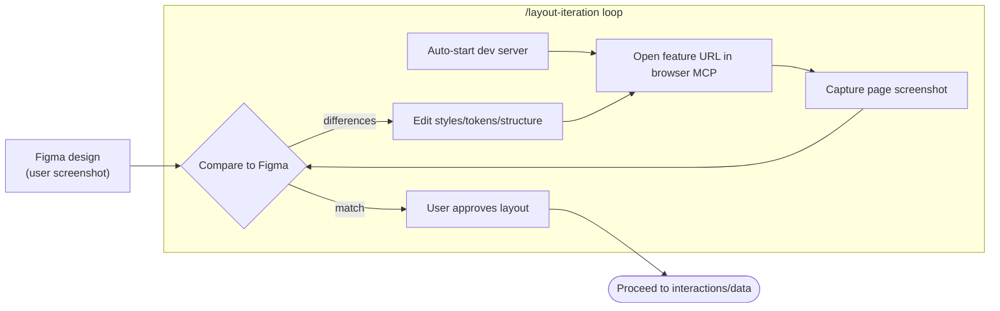

`generate-css-wireframe` complements this earlier, during spec generation, by producing the
container-hierarchy wireframe chapter that the layout implementation later realizes.

---

## 10. End-to-End: From Idea to Merged Feature

Putting all the pieces together, here is the full lifecycle a feature travels through:

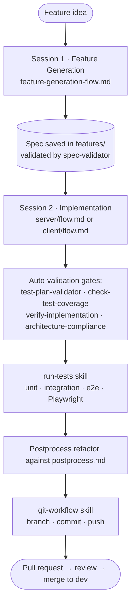

### Key principles baked into the system

1. **Spec is the contract.** No code without a validated spec; all verification compares back to it.
2. **One task per session.** Generation and implementation never mix; backend and frontend never mix.
3. **Validation is automatic and unskippable.** Skills + independent subagents gate every transition.
4. **Independent verification.** Subagents run in separate context to avoid confirmation bias.
5. **Minimal human gates.** Backend pauses only at the test plan; frontend at plan, layout, and tests.
6. **No stray markdown.** Flows only ever write the spec file; plans/summaries are plain text output.
7. **Autonomy on infrastructure.** The agent always auto-starts the app (start command from `ai/project.md`) — never asks the user.

---

*Flow definition: `ai/flows/full-flow.md`. Setup-wide documentation: [`overview.md`](./overview.md).*
