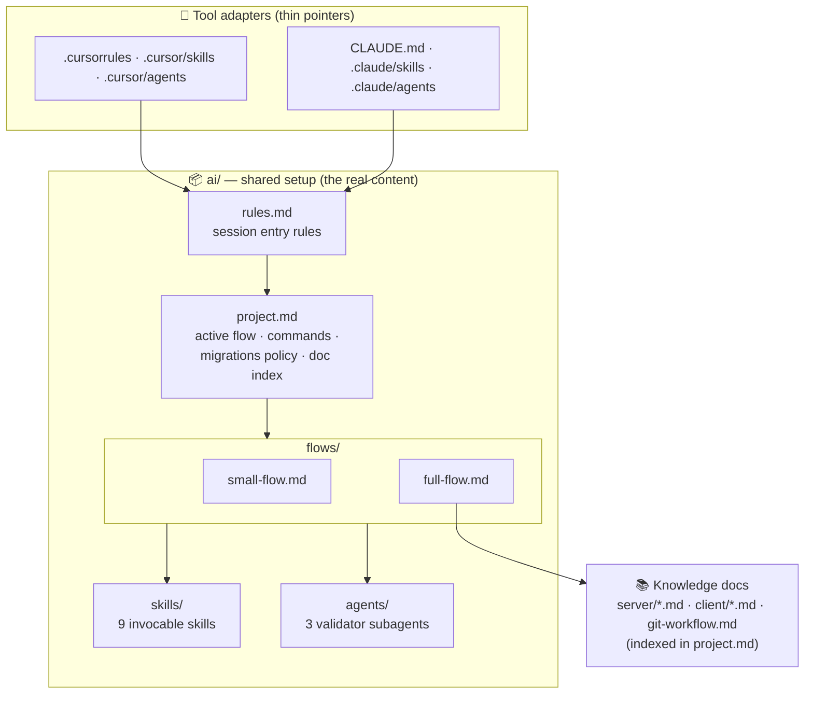
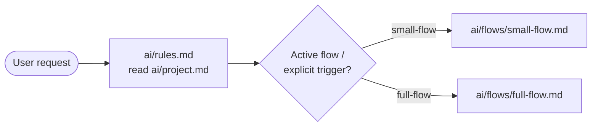
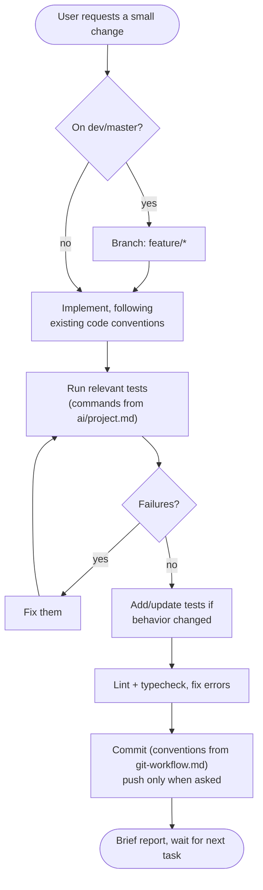
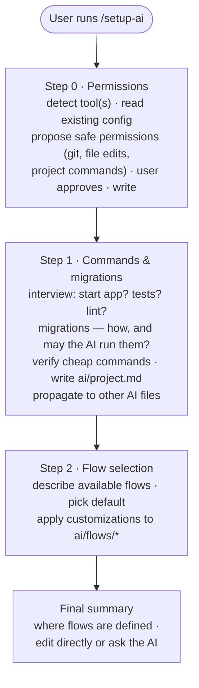
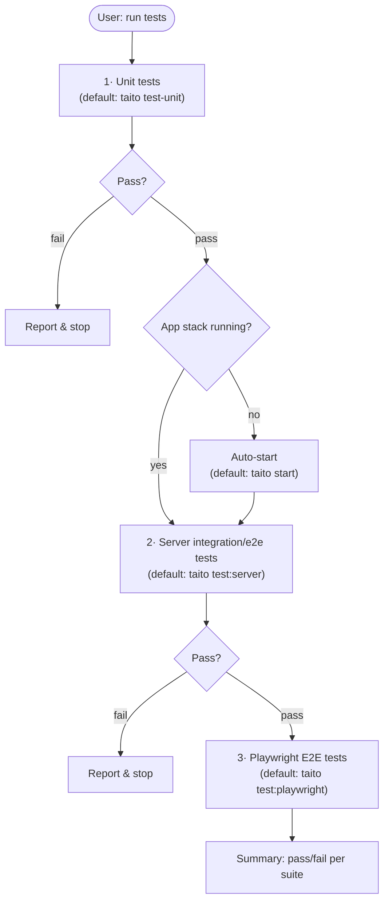
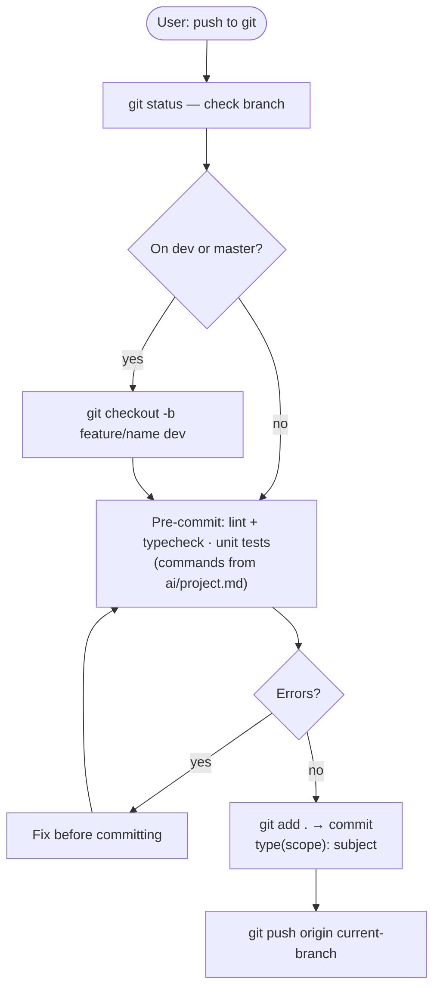

# AI Development Setup — Overview

This document describes the AI-assisted development setup for human readers: how it is structured,
how it is configured for a project, and how the selectable development flows work. The deep-dive
into the specs-driven flow lives in [`full-flow.md`](./full-flow.md).

The setup works with both **Cursor and Claude Code**. Everything of substance lives in the shared
`ai/` directory; the tool-specific files (`.cursorrules`, `CLAUDE.md`, `.cursor/`, `.claude/`) are
thin adapters that point into it. That, plus keeping all project-specific commands in one config
file, makes the setup copyable into any project — including projects with a different stack or
language.

---

## 1. Structure

| Piece | Role |
|---|---|
| `ai/rules.md` | Read at the start of every session: read `project.md`, follow the active flow, app auto-start rules, git rules. |
| `ai/project.md` | **Single source of truth for project facts**: the active flow, commands for app/tests/lint, the database-migrations policy, and where the knowledge docs live. Every flow and skill defers to it — if a command here conflicts with one written elsewhere, this file wins. |
| `ai/flows/` | The selectable development flows (see below). |
| `ai/skills/` | Instructions for invocable skills (`/run-tests`, `/git-workflow`, `/setup-ai`, spec validation, layout iteration, ...). |
| `ai/agents/` | Instructions for the independent verifier subagents used by the full flow. |
| Tool adapters | Register each skill/agent with Cursor and Claude Code and point at the `ai/` instructions. |

---

## 2. Flows

A **flow** defines how the AI carries out development tasks. The active flow is named in
`ai/project.md`; the user can override it for a single task by asking explicitly, and requests
that clearly use another flow's triggers (e.g. *"let's generate a feature spec"*) follow that
flow.

### small-flow — implement · test · lint · commit

Lightweight flow for small edits, bug fixes, and small features. No specs, no session boundaries,
no validation gates.

If a "small" request turns out to be large, the flow says so and suggests switching to the full
flow instead of silently doing a big change.

### full-flow — specs-driven development

The heavyweight flow: a feature spec is the single source of truth, one task per session, TDD on
the backend, layout-first on the frontend, and mandatory validation gates checked by skills and
independent subagents. Documented in detail in [`full-flow.md`](./full-flow.md).

**Choosing between them**: small-flow suits day-to-day maintenance and teams that find the full
flow too heavy; full-flow suits larger feature work where specs and independent verification pay
off. Teams can also keep small-flow active and invoke the full flow only for selected features.

Adding a new flow = adding a file to `ai/flows/` and mentioning it in `ai/project.md`.

---

## 3. Configuration: the `/setup-ai` Skill

`/setup-ai` (defined in `ai/skills/setup-ai.md`) adapts the setup to a project. It is
**re-runnable**: every step first reports the current state and asks whether to keep or change it.

- **Permissions** (step 0): safe git commands (`status`, `diff`, `log`, `branch`, `checkout`,
  `add`, `commit`), reading/editing files in the repo, and the project's test/lint/app commands.
  `git push` and anything touching remote environments always keep prompting. Written to
  `.claude/settings.json` (Claude Code) or `.cursor/cli.json` (Cursor CLI); the user sees and
  approves the exact entries first.
- **Commands & migrations** (step 1): the answers land in `ai/project.md`, and any AI files with
  now-contradicting hardcoded commands are updated. This is the step that makes the setup work in
  a non-template project (different test runner, no Taito CLI, special services).
- **Flow selection** (step 2): sets **Active Flow** in `ai/project.md` and applies any requested
  tweaks (add/remove/change steps) directly to the flow files.

---

## 4. Flow-Independent Skills

### `run-tests`

Saying *"run tests"* runs all suites in order, using the test commands from `ai/project.md`
(template defaults shown), and **auto-starts the app stack when needed** — it never asks the user
to start it.

### `git-workflow`

The `git-workflow` skill and `git-workflow.md` enforce Angular/commitlint conventions so that
`semantic-release` can auto-generate versions and release notes.

Commit format: `<type>(<scope>): <subject>` where type ∈ `wip, feat, fix, docs, style, refactor,
perf, test, revert, build, ci, chore`; subject is lowercase, imperative, no trailing period.
`dev` and `master` are **not protected** — work branches off `dev` and merges back via PR.

---

## 5. Using the Setup in Another Project

1. Copy `ai/`, the tool adapters you need (`.cursorrules` + `.cursor/`, and/or `CLAUDE.md` +
   `.claude/`), and `git-workflow.md` into the target repo.
2. Optionally copy the knowledge docs (`server/*.md`, `client/*.md`) if the target follows similar
   patterns — the full flow depends on them, the small flow doesn't. Update the knowledge-doc
   index in `ai/project.md` either way.
3. Run `/setup-ai` there. It replaces the template's commands with the project's own, records the
   migrations policy, sets up permissions, and lets the team pick and customize a flow.

## 6. Customizing

Everything is plain markdown. To change, add, or remove a step in any flow, either edit the file
in `ai/flows/` directly or ask the AI to make the edit. Re-running `/setup-ai` reviews the whole
configuration step by step.
